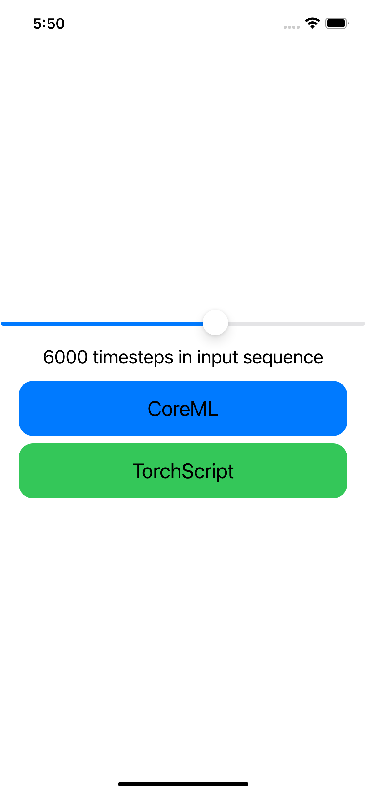

## RNN conversion

The python file `convert_models.py` details the architecture and the conversion method used for both TorchScript and CoreML RNN models. 

## TorchScript vs CoreML inference time benchmark

A simple Swift project can be found in the `TorchScriptVSCoreML` directory to assess the inference time both TorchScript and CoreML RNN models. To reproduce this assessment follow those steps: 
- open a terminal and run
```bash
cd TorchScriptVSCoreML
pod install
```
- open  `TorchScriptVSCoreML.xcworkspace`
- move the slider and set to a sequence length above 2000 (20 sec of audio in our use-case) as displayed down below
- see in the terminal how the different models react

<p align="center" width="100%">
    
</p>